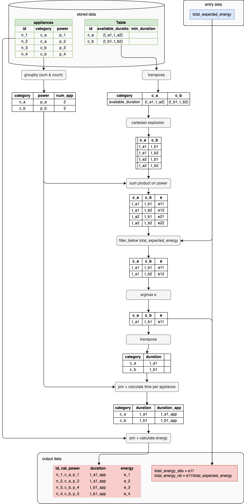

# Optimisation

This document explains the computation of the energy consumption of appliances. 
The optimisation relies on two major specifications:
1. the appliances of a same category have the same operating time (specification **FUN 5.3**)
2. the number of combinations of categories' available durations is limited (**TEC 1**)

**FUN 5.3** allows to perform the optimisation at category level as category can be modeled as a consumption appliance with the power being the sum of the appliances of the category. 
**TEC 1** allows to perform a brut force algorithm by testing all the combinations of categories' possible operating time. 

The algorithm presented below:

